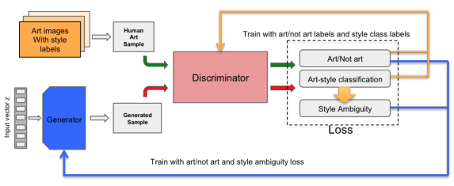
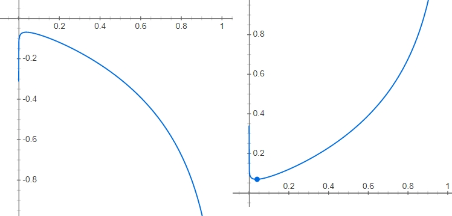
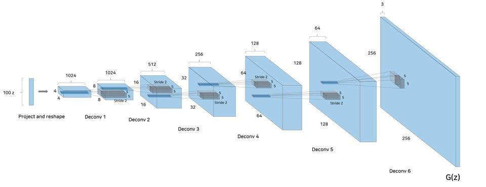
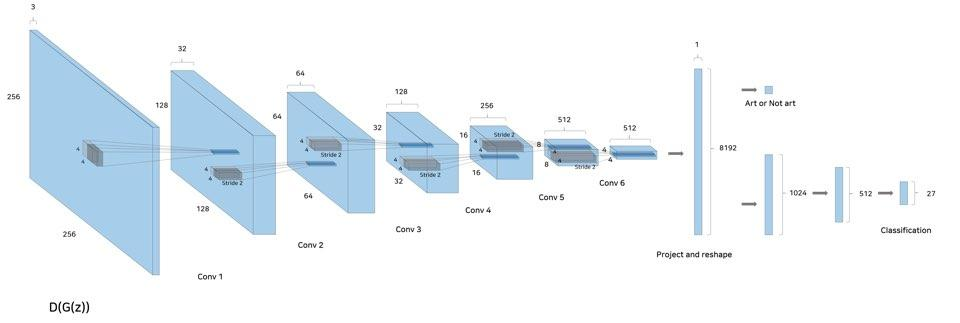
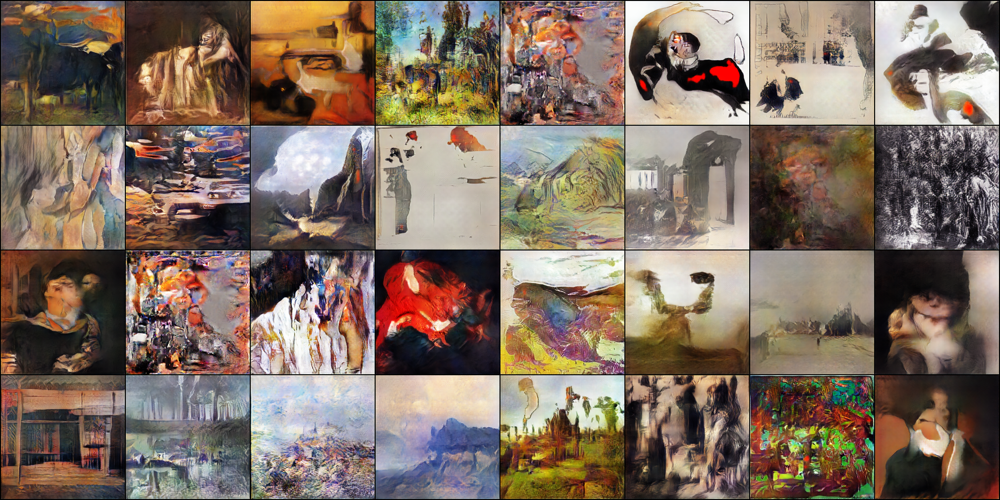

# CAN
*Creative Adversarial Networks, Generating "Art" by Learning About Styles and Deviating from Style Norms*

#### 1. Authors

Ahmed Elgammal, Bingchen Liu, Mohamed Elhoseiny, Marian Mazzone

[[Paper]](https://arxiv.org/abs/1706.07068)

#### 2. Introduction
GAN을 이용하여 **창의적인** 인공지능을 만드는 것이 핵심이다.  
이 논문에서는 2가지 심리학적 개념을 수식화하여 
 - 최소노력의 원리(Principle of least effort) : 기존의 style을 깨는 style break를 이르키는 것
 - 각성의 수준 (Level of arousal) : 미술이 내포하는 자극의 특성 ' 새로움, 놀라움, 복잡성, 당혹함, 애매함'이 있음
 CAN은 5가지 중 '애매함(ambiguity)'를 높히는 방향으로 작품 생성하며, 지금과 전혀 다른 새로운 style을 만든다.

학습 데이터로 Wikiart를 사용하며 27개의 미술사조로 분류되어 있다. 총 81,445개의 각기 다른 크기의 이미지를 가진다.


<p align="center">
    
</p>

<p align="center">
    
</p>

##### **수식기호 이해**
>-  = 데이터에서 샘플링한 real image와 그에 해당하는 style label
>-  = 입력된 image가 real인지 fake인지 구분
>-  = 입력된 image의 class를 구별
>-  = 임으로 생성된 노이즈 분포(p_z)에서 샘플링한 노이즈(z) 
>-  = class의 갯수 

##### **수식 이해**
첫 번째 term의 
두 번째 term의 만 보면 일반적인 GAN의 공식과 같다. 
이 수식은 입력된 이미지가 **예술인지, 아닌지** 판단한다.


과

은 stype ambiguity를 만들어내는 수식이다. K는 27개의 미술사조 class 갯수이며 generator에서 생성된 이미지가 27개의 미술사조에 포함되는지
판단하는 loss이다. 학습이 잘되는 경우 generator에서 생성된 이미지는 각 class에 속할 확률이 1/27이 된다.

<p align="center">
    
</p>

위 그래프를 보면, 그림이 특정 class에 속할 경우 패널티를 받아 가파른 경사면을 통과하며 수렴한다. (최적치로 이동하면 art-style 어느 곳에도 속하지 않게 됨)

#### 3. Network
 - Generator
    <p align="center">
        
    </p>

 - discriminator
    <p align="center">
        
    </p>


#### 4. Implemenation
```
python can.py
```

#### 5. results (100 epoch)
<p align="center">
    
</p>

#### 참고
[KIMSEUNGGYU/AI-Art-Lab](https://github.com/KIMSEUNGGYU/AI-Art-Lab)
